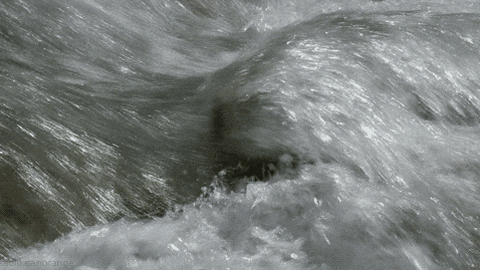
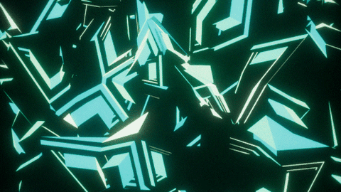

Several experiments were conducted to validate the ideas and models proposed in this work. The details regarding all these experiments can be found here.

<!-- 3.1. TexStat Properties ------------------------------------------------------------------------------------------------------------------------------------------>

3.1. TexStat Properties 📊

Two desirable properties for a loss function tailored to texture sounds are <strong>stability under time shifting</strong> and <strong>robustness to added noise</strong>. To evaluate these in the <code>TexStat</code> loss, we measured the loss between original and transformed sounds from the <a href="https://huggingface.co/datasets/cordutie/MicroTex" target="_blank" style="font-weight: normal;"><code>MicroTex</code></a> dataset, focusing specifically on the <code>Freesound</code> class. This subset was selected because it includes the most representative environmental textures—long and dynamic enough to permit meaningful transformations. The other two classes were excluded as their sounds are generally too short or too quiet for these operations without introducing significant distortions. For comparison, the same analysis was conducted using the MSS loss, and a summary of the results is shown below.

  <table style="width: 100%; border-collapse: collapse; font-size: 0.9em;">
    <thead style="background-color: #f2f2f2;">
      <tr>
        <th>Transformation</th>
        <th colspan="3"><code>TexStat</code></th>
        <th colspan="3">MSS</th>
      </tr>
      <tr>
        <th></th>
        <th>10%</th>
        <th>30%</th>
        <th>50%</th>
        <th>10%</th>
        <th>30%</th>
        <th>50%</th>
      </tr>
    </thead>
    <tbody>
      <tr>
        <td style="text-align: center; vertical-align: middle;">Time-Shift</td>
        <td>0.04 ± 0.03</td>
        <td>0.04 ± 0.03</td>
        <td>0.04 ± 0.03</td>
        <td>6.09 ± 1.22</td>
        <td>6.27 ± 1.38</td>
        <td>6.29 ± 1.41</td>
      </tr>
      <tr>
        <td style="text-align: center; vertical-align: middle;">Noise-Add</td>
        <td>2.08 ± 1.99</td>
        <td>2.51 ± 2.21</td>
        <td>2.65 ± 2.27</td>
        <td>11.79 ± 4.91</td>
        <td>16.84 ± 5.92</td>
        <td>19.57 ± 6.26</td>
      </tr>
    </tbody>
  </table>
  

    <strong>Table:</strong> Loss measurements (<code>mean ± std</code>) between original sounds in the <code>Freesound</code> class and their time-shifted or noise-added versions. Time shift is defined as a percentage of the total signal duration, and noise level is defined by its maximum amplitude relative to the original. All values were computed over one-second segments. For reference, well-trained <code>TexStat</code> models typically converge below 3, while MSS loss values remain acceptable below 10.
  

The results show that <code>TexStat</code> is highly stable under time shifting, consistently incurring only a minor loss increase. It also handles added noise with resilience, displaying a sublinear increase in loss as noise intensity grows—indicating strong robustness under both transformations.

<!-- 3.2. TexStat Benchmarks ------------------------------------------------------------------------------------------------------------------------------------------>

3.2. TexStat Benchmarks 📊

To evaluate the computational efficiency of the <code>TexStat</code> loss function, we benchmarked its <strong>forward computation time</strong>, <strong>backward pass duration</strong>, and <strong>GPU memory usage</strong>. These metrics were measured over multiple runs, capturing the time taken for both loss evaluation and gradient descent while monitoring memory allocation. For reference, we included measurements for other commonly used loss functions such as MSS, MSE, and MAE. The results are summarized in the table below.

  <table style="width: 100%; border-collapse: collapse; font-size: 0.9em;">
    <thead style="background-color: #f2f2f2;">
      <tr>
        <th>Loss</th>
        <th>Forward Pass Time (ms)</th>
        <th>Backward Pass Time (ms)</th>
        <th>Memory Usage (MB)</th>
      </tr>
    </thead>
    <tbody>
      <tr>
        <td><code>TexStat</code></td>
        <td>93.5 ± 0.4</td>
        <td>154.6 ± 0.4</td>
        <td>0.84 ± 2.5</td>
      </tr>
      <tr>
        <td>MSS</td>
        <td>3.9 ± 0.3</td>
        <td>8.5 ± 0.3</td>
        <td>0.85 ± 2.6</td>
      </tr>
      <tr>
        <td>MSE</td>
        <td>0.2 ± 0.3</td>
        <td>0.2 ± 0.1</td>
        <td>1.7 ± 5.0</td>
      </tr>
      <tr>
        <td>MAE</td>
        <td>0.1 ± 0.0</td>
        <td>0.2 ± 0.1</td>
        <td>0.8 ± 2.5</td>
      </tr>
    </tbody>
  </table>
  

    <strong>Table:</strong> Runtime and memory benchmarks for four loss functions on batches of 32 audio signals (each of size 65536, ~1.5 seconds at 44.1kHz). All measurements were performed using CUDA on an NVIDIA RTX 4090 GPU.
  

As expected, <code>TexStat</code> is computationally more intensive than simpler loss functions like MSE or MAE, due to its domain-specific structure. However, it maintains a comparable memory footprint to other losses, demonstrating that its expressiveness does not come at a significant memory cost.

<!-- 3.3. Summary Statistics as a Feature Vector----------------------------------------------------------------------------------------------------------------------->

3.3. Summary Statistics as a Feature Vector 📊

To evaluate the effectiveness of <code>TexStat</code> summary statistics as a powerful feature representation—comparable to embeddings used in metrics like FAD—we conducted a classification experiment. All data from the three selections in the <a href="https://huggingface.co/datasets/cordutie/MicroTex" target="_blank" style="font-weight: normal;"><code>MicroTex</code></a> dataset were segmented, and both <code>TexStat</code> summary statistics and VGGish embeddings <a href="https://research.google/pubs/pub45611/" target="_blank" style="font-weight: normal;">[VGGish]</a> were computed. For each feature type, we trained a downstream multi-layer perceptron (MLP) classifier with hidden layers of size 128 and 64. The performance comparison is summarized in the table below.

  <table style="width: 100%; border-collapse: collapse; font-size: 0.9em;">
    <thead style="background-color: #f2f2f2;">
      <tr>
        <th>Model</th>
        <th>Selection</th>
        <th>Accuracy</th>
        <th>Precision</th>
        <th>Recall</th>
        <th>F1</th>
      </tr>
    </thead>
    <tbody>
      <tr><td><code>TexStat</code></td><td>BOReilly</td><td>0.94</td><td>0.94</td><td>0.94</td><td>0.94</td></tr>
      <tr><td>VGGish</td><td>BOReilly</td><td>0.71</td><td>0.73</td><td>0.71</td><td>0.71</td></tr>
      <tr><td><code>TexStat</code></td><td>Freesound</td><td>0.99</td><td>0.99</td><td>0.99</td><td>0.99</td></tr>
      <tr><td>VGGish</td><td>Freesound</td><td>0.98</td><td>0.99</td><td>0.98</td><td>0.98</td></tr>
      <tr><td><code>TexStat</code></td><td>Syntex</td><td>1.00</td><td>1.00</td><td>1.00</td><td>1.00</td></tr>
      <tr><td>VGGish</td><td>Syntex</td><td>0.95</td><td>0.95</td><td>0.95</td><td>0.94</td></tr>
    </tbody>
  </table>
  

    <strong>Table:</strong> Classification performance of MLP models trained using either <code>TexStat</code> summary statistics or VGGish embeddings. Results are shown for the three subsets of the <code>MicroTex</code> dataset.
  

These results demonstrate that in the domain of texture sounds, <code>TexStat</code> summary statistics serve as a strictly more informative representation than general-purpose embeddings like VGGish. This makes them promising candidates for use in downstream evaluation metrics and perceptual comparisons.

<!-- 3.4. TexEnv Resynthesis------------------------------------------------------------------------------------------------------------------------------------------->

3.4. TexEnv Resynthesis 🎧

Extensive exploration using the <code>TexEnv</code> synthesizer in resynthesis tasks, employing a signal processing-based parameter extractor, was conducted to better understand its behavior and limitations. A summary of sound examples can be found below.

  

  <!-- Header Row -->
  
<strong>Input Texture</strong>

  
NF=16, parameters count=256

  
NF=16, parameters count=512

  
NF=24, parameters count=256

  
NF=24, parameters count=512

  <!-- Bubbles -->
  

    <audio controls style="width: 100%;">
      <source src="./assets/audios/texenv_resynthesis/bubbles_original.mp3" type="audio/mpeg" />
      Your browser does not support the audio element.
    </audio>
  

  

    <audio controls style="width: 100%;">
      <source src="./assets/audios/texenv_resynthesis/bubbles_resynth_N_F_16_param_per_env_256.mp3" type="audio/mpeg" />
      Your browser does not support the audio element.
    </audio>
  

  

    <audio controls style="width: 100%;">
      <source src="./assets/audios/texenv_resynthesis/bubbles_resynth_N_F_16_param_per_env_512.mp3" type="audio/mpeg" />
      Your browser does not support the audio element.
    </audio>
  

  

    <audio controls style="width: 100%;">
      <source src="./assets/audios/texenv_resynthesis/bubbles_resynth_N_F_24_param_per_env_256.mp3" type="audio/mpeg" />
      Your browser does not support the audio element.
    </audio>
  

  

    <audio controls style="width: 100%;">
      <source src="./assets/audios/texenv_resynthesis/bubbles_resynth_N_F_24_param_per_env_512.mp3" type="audio/mpeg" />
      Your browser does not support the audio element.
    </audio>
  

  <!-- Fire -->
  

    <audio controls style="width: 100%;">
      <source src="./assets/audios/texenv_resynthesis/fire_original.mp3" type="audio/mpeg" />
      Your browser does not support the audio element.
    </audio>
  

  

    <audio controls style="width: 100%;">
      <source src="./assets/audios/texenv_resynthesis/fire_resynth_N_F_16_param_per_env_256.mp3" type="audio/mpeg" />
      Your browser does not support the audio element.
    </audio>
  

  

    <audio controls style="width: 100%;">
      <source src="./assets/audios/texenv_resynthesis/fire_resynth_N_F_16_param_per_env_512.mp3" type="audio/mpeg" />
      Your browser does not support the audio element.
    </audio>
  

  

    <audio controls style="width: 100%;">
      <source src="./assets/audios/texenv_resynthesis/fire_resynth_N_F_24_param_per_env_256.mp3" type="audio/mpeg" />
      Your browser does not support the audio element.
    </audio>
  

  

    <audio controls style="width: 100%;">
      <source src="./assets/audios/texenv_resynthesis/fire_resynth_N_F_24_param_per_env_512.mp3" type="audio/mpeg" />
      Your browser does not support the audio element.
    </audio>
  

  <!-- River -->
  

    <audio controls style="width: 100%;">
      <source src="./assets/audios/texenv_resynthesis/water_original.mp3" type="audio/mpeg" />
      Your browser does not support the audio element.
    </audio>
  

  

    <audio controls style="width: 100%;">
      <source src="./assets/audios/texenv_resynthesis/water_resynth_N_F_16_param_per_env_256.mp3" type="audio/mpeg" />
      Your browser does not support the audio element.
    </audio>
  

  

    <audio controls style="width: 100%;">
      <source src="./assets/audios/texenv_resynthesis/water_resynth_N_F_16_param_per_env_512.mp3" type="audio/mpeg" />
      Your browser does not support the audio element.
    </audio>
  

  

    <audio controls style="width: 100%;">
      <source src="./assets/audios/texenv_resynthesis/water_resynth_N_F_24_param_per_env_256.mp3" type="audio/mpeg" />
      Your browser does not support the audio element.
    </audio>
  

  

    <audio controls style="width: 100%;">
      <source src="./assets/audios/texenv_resynthesis/water_resynth_N_F_24_param_per_env_512.mp3" type="audio/mpeg" />
      Your browser does not support the audio element.
    </audio>
  

  <!-- Wind -->
  

    <audio controls style="width: 100%;">
      <source src="./assets/audios/texenv_resynthesis/wind_original.mp3" type="audio/mpeg" />
      Your browser does not support the audio element.
    </audio>
  

  

    <audio controls style="width: 100%;">
      <source src="./assets/audios/texenv_resynthesis/wind_resynth_N_F_16_param_per_env_256.mp3" type="audio/mpeg" />
      Your browser does not support the audio element.
    </audio>
  

  

    <audio controls style="width: 100%;">
      <source src="./assets/audios/texenv_resynthesis/wind_resynth_N_F_16_param_per_env_512.mp3" type="audio/mpeg" />
      Your browser does not support the audio element.
    </audio>
  

  

    <audio controls style="width: 100%;">
      <source src="./assets/audios/texenv_resynthesis/wind_resynth_N_F_24_param_per_env_256.mp3" type="audio/mpeg" />
      Your browser does not support the audio element.
    </audio>
  

  

    <audio controls style="width: 100%;">
      <source src="./assets/audios/texenv_resynthesis/wind_resynth_N_F_24_param_per_env_512.mp3" type="audio/mpeg" />
      Your browser does not support the audio element.
    </audio>
  

  

<strong>Sound Examples 3.1.</strong> 4 sound textures are resynthesized using <code>TexEnv</code>. Parameters to run the synthesizer are computed using a DSP-based parameter extractor. The synthesis part is run using different combination of parameters to test the need for bigger filterbanks and parameters count per band. Parameters are counted for frames of around 0.74 seconds. For reference, 16 filters using 256 parameters each correspond to compression of 800% to the real sound at 44100 Hz, meanwhile for 24 filters using 512 parameters each correspond to compression of around 266%.

Some key findings were the following:
<ul>
  <li>Water-like sounds (e.g., flowing water, rain, bubbling) benefited from larger filterbanks but not larger parameter sets.</li>
  <li>Crackling sounds (e.g., fireworks, bonfires) improved with larger parameter sets but were less sensitive to filterbank size.</li>
</ul>
These insights were used to determine the optimal parameters for model training.

<!-- 3.5. TexDSP Trained Models---------------------------------------------------------------------------------------------------------------------------------------->

3.5. TexDSP Trained Models 🎧📊

To demonstrate the capabilities of <code>TexStat</code>, we trained a set of <code>TexDSP</code> models using it as the sole loss function. Each model was trained with different parameters suited to specific texture sound classes. The goal was to explore how well <code>TexStat</code> alone could guide learning in a generative setting.

<strong>Training Details:</strong> A curated selection of texture sounds from Freesound was used per model, each tailored with unique parameters chosen from prior resynthesis exploration (see <a href="#subsec:experiments_resynthesis">Section: Resynthesis</a>). The encoder and decoder MLPs had at most 3 layers and no more than 512 parameters. This ensured models stayed under 25 MB, suitable for real-time applications. All models used the default <code>TexStat</code> α and β parameters, a shared optimizer, and trained for up to 1500 epochs with early stopping. For comparison, a NoiseBandNet model was also trained under default settings for each case.

<strong>Validation Method:</strong> A held-out subset of each dataset was resynthesized using both the <code>TexDSP</code> and NoiseBandNet models. We then segmented both original and resynthesized signals and computed Fréchet Audio Distance (FAD) using VGGish and our proposed summary statistics. We also computed frame-level <code>TexStat</code> and MSS losses, reporting mean ± standard deviation. Results are shown below.

  <table style="width: 100%; border-collapse: collapse; font-size: 0.85em;">
    <thead style="background-color: #f2f2f2;">
      <tr>
        <th rowspan="2">Texture</th>
        <th colspan="4">FAD</th>
        <th colspan="4">Loss Metrics</th>
      </tr>
      <tr>
        <th>VGGish <code>TexDSP</code></th>
        <th>VGGish NBN</th>
        <th>Ours <code>TexDSP</code></th>
        <th>Ours NBN</th>
        <th><code>TexStat</code> <code>TexDSP</code></th>
        <th><code>TexStat</code> NBN</th>
        <th>MSS <code>TexDSP</code></th>
        <th>MSS NBN</th>
      </tr>
    </thead>
    <tbody>
      <tr><td>Bubbles</td><td>35.20</td><td><strong>21.37</strong></td><td>1.86</td><td><strong>1.15</strong></td><td>1.2 ± 0.3</td><td><strong>0.7 ± 0.1</strong></td><td>6.6 ± 0.3</td><td><strong>4.7 ± 0.1</strong></td></tr>
      <tr><td>Fire</td><td>11.86</td><td><strong>2.53</strong></td><td>6.14</td><td><strong>1.52</strong></td><td>2.8 ± 2.1</td><td><strong>1.7 ± 1.0</strong></td><td>9.6 ± 1.3</td><td><strong>4.5 ± 0.2</strong></td></tr>
      <tr><td>Keyboard</td><td>13.02</td><td><strong>9.70</strong></td><td><strong>16.64</strong></td><td>277.12</td><td><strong>5.7 ± 2.0</strong></td><td>20.0 ± 7.7</td><td><strong>9.1 ± 0.7</strong></td><td>13.8 ± 0.6</td></tr>
      <tr><td>Rain</td><td><strong>9.09</strong></td><td>11.31</td><td><strong>0.98</strong></td><td>6.19</td><td><strong>0.5 ± 0.2</strong></td><td>2.4 ± 2.0</td><td><strong>9.0 ± 0.2</strong></td><td>9.1 ± 0.4</td></tr>
      <tr><td>River</td><td><strong>43.66</strong></td><td>49.85</td><td><strong>0.80</strong></td><td>1.75</td><td><strong>0.5 ± 0.1</strong></td><td>0.6 ± 0.1</td><td><strong>6.0 ± 0.6</strong></td><td>6.7 ± 0.3</td></tr>
      <tr><td>Shards</td><td>4.64</td><td><strong>1.36</strong></td><td><strong>3.79</strong></td><td>7.58</td><td><strong>1.0 ± 0.2</strong></td><td>1.1 ± 0.3</td><td><strong>7.9 ± 0.2</strong></td><td>8.8 ± 0.2</td></tr>
      <tr><td>Waterfall</td><td><strong>18.23</strong></td><td>25.88</td><td><strong>0.53</strong></td><td>1.06</td><td><strong>0.3 ± 0.0</strong></td><td>0.4 ± 0.0</td><td><strong>5.0 ± 0.0</strong></td><td>6.3 ± 0.0</td></tr>
      <tr><td>Wind</td><td><strong>9.66</strong></td><td>31.35</td><td><strong>1.95</strong></td><td>8.48</td><td><strong>0.8 ± 0.5</strong></td><td>1.1 ± 0.7</td><td><strong>5.6 ± 0.1</strong></td><td>5.8 ± 0.2</td></tr>
    </tbody>
  </table>
  

    <strong>Table:</strong> Validation metrics for both <code>TexDSP</code> and NoiseBandNet models across various texture sounds. FAD metrics are computed using VGGish and our proposed feature representation (lower is better). Frame-level <code>TexStat</code> and MSS loss values are shown as mean ± std. Best results per row are highlighted in bold.
  

<strong>Results:</strong> These results yield three primary insights. First, performance varied between textures, mirroring observations from McDermott and Simoncelli and aligning with the limitations discussed in the last section. Second, although <code>TexDSP</code> was not designed for precise reconstruction, some models unexpectedly outperformed their NoiseBandNet counterparts—even in metrics favoring reconstruction. Third, the metrics derived from our models appeared to align more closely with perceptual quality as judged informally. However, to substantiate this, a formal subjective listening test would be necessary—an evaluation left for future work.

  

  <!-- Header Row -->
  
<strong>Texture</strong>

  
<strong>Input</strong>

  
<strong>Resynthesis</strong>

  <!-- Bubbles -->
  

    
  

  

    <audio controls style="width: 100%;">
      <source src="./assets/audios/texdsp_resynthesis/bubbles_copy.mp3" type="audio/mpeg" />
      Your browser does not support the audio element.
    </audio>
  

  

    <audio controls style="width: 100%;">
      <source src="./assets/audios/texdsp_resynthesis/bubbles_resynth.mp3" type="audio/mpeg" />
      Your browser does not support the audio element.
    </audio>
  

  <!-- Fire -->
  

    
  

  

    <audio controls style="width: 100%;">
      <source src="./assets/audios/texdsp_resynthesis/fire.mp3" type="audio/mpeg" />
      Your browser does not support the audio element.
    </audio>
  

  

    <audio controls style="width: 100%;">
      <source src="./assets/audios/texdsp_resynthesis/fire_resynth.mp3" type="audio/mpeg" />
      Your browser does not support the audio element.
    </audio>
  

  <!-- Bubbles -->
  

    
  

  

    <audio controls style="width: 100%;">
      <source src="./assets/audios/texdsp_resynthesis/keyboard.mp3" type="audio/mpeg" />
      Your browser does not support the audio element.
    </audio>
  

  

    <audio controls style="width: 100%;">
      <source src="./assets/audios/texdsp_resynthesis/keyboard_resynth.mp3" type="audio/mpeg" />
      Your browser does not support the audio element.
    </audio>
  

  <!-- Bubbles -->
  

    
  

  

    <audio controls style="width: 100%;">
      <source src="./assets/audios/texdsp_resynthesis/rain.mp3" type="audio/mpeg" />
      Your browser does not support the audio element.
    </audio>
  

  

    <audio controls style="width: 100%;">
      <source src="./assets/audios/texdsp_resynthesis/rain_resynth.mp3" type="audio/mpeg" />
      Your browser does not support the audio element.
    </audio>
  

  <!-- Bubbles -->
  

    
  

  

    <audio controls style="width: 100%;">
      <source src="./assets/audios/texdsp_resynthesis/river.mp3" type="audio/mpeg" />
      Your browser does not support the audio element.
    </audio>
  

  

    <audio controls style="width: 100%;">
      <source src="./assets/audios/texdsp_resynthesis/river_resynth.mp3" type="audio/mpeg" />
      Your browser does not support the audio element.
    </audio>
  

  <!-- Bubbles -->
  

    
  

  

    <audio controls style="width: 100%;">
      <source src="./assets/audios/texdsp_resynthesis/shards.mp3" type="audio/mpeg" />
      Your browser does not support the audio element.
    </audio>
  

  

    <audio controls style="width: 100%;">
      <source src="./assets/audios/texdsp_resynthesis/shards_resynth.mp3" type="audio/mpeg" />
      Your browser does not support the audio element.
    </audio>
  

  
  <!-- Bubbles -->
  

    
  

  

    <audio controls style="width: 100%;">
      <source src="./assets/audios/texdsp_resynthesis/waterfall.mp3" type="audio/mpeg" />
      Your browser does not support the audio element.
    </audio>
  

  

    <audio controls style="width: 100%;">
      <source src="./assets/audios/texdsp_resynthesis/waterfall_resynth.mp3" type="audio/mpeg" />
      Your browser does not support the audio element.
    </audio>
  

  <!-- Bubbles -->
  

    
  

  

    <audio controls style="width: 100%;">
      <source src="./assets/audios/texdsp_resynthesis/wind.mp3" type="audio/mpeg" />
      Your browser does not support the audio element.
    </audio>
  

  

    <audio controls style="width: 100%;">
      <source src="./assets/audios/texdsp_resynthesis/wind_resynth.mp3" type="audio/mpeg" />
      Your browser does not support the audio element.
    </audio>
  

  

<strong>Sound Examples 3.2.</strong> Resynthesis sounds using different <code>TexDSP</code> trained models.

<!-- 3.6. TexDSP Timbre Transfer--------------------------------------------------------------------------------------------------------------------------------------->

3.6. TexDSP Timbre Transfer 🎧

A notable application of DDSP is timbre transfer, where a model trained on one timbre can be influenced by another sound. The original paper showcased this by transferring the timbre of a violin to a voice recording, using pitch and loudness as key factors. Our models can achieve similar results with textural sounds, although the process is more intricate. Unlike musical timbres, where pitch plays a central role, textural sounds lack such defining features, which makes the transfer more complex. Nevertheless, some compelling examples of this phenomenon are highlighted below. For more examples, see the link below.

  

  <!-- Header Row -->
  

  
<strong>Input Texture</strong>

  
<strong>Texture Model</strong>

  
<strong>Result</strong>

  <!-- Wind to bubbles -->
  
<strong>Wind</strong>

  

    <audio controls style="width: 100%;">
      <source src="./assets/audios/texdsp_resynthesis/wind.mp3" type="audio/mpeg" />
      Your browser does not support the audio element.
    </audio>
  

  

    
  

  

    <audio controls style="width: 100%;">
      <source src="./assets/audios/texdsp_timbre_transfer/wind_to_bubbles.mp3" type="audio/mpeg" />
      Your browser does not support the audio element.
    </audio>
  

  <!-- Bubble to river -->
  
<strong>Bubbles</strong>

  

    <audio controls style="width: 100%;">
      <source src="./assets/audios/texdsp_resynthesis/bubbles_copy.mp3" type="audio/mpeg" />
      Your browser does not support the audio element.
    </audio>
  

  

    
  

  

    <audio controls style="width: 100%;">
      <source src="./assets/audios/texdsp_timbre_transfer/bubbles_to_river.mp3" type="audio/mpeg" />
      Your browser does not support the audio element.
    </audio>
  

  <!-- Fire to wind -->
  
<strong>Fire</strong>

  

    <audio controls style="width: 100%;">
      <source src="./assets/audios/texdsp_resynthesis/fire.mp3" type="audio/mpeg" />
      Your browser does not support the audio element.
    </audio>
  

  

    
  

  

    <audio controls style="width: 100%;">
      <source src="./assets/audios/texdsp_timbre_transfer/fire_to_wind.mp3" type="audio/mpeg" />
      Your browser does not support the audio element.
    </audio>
  

  

<strong>Sound Examples 3.3.</strong> Timbre transfer examples using different <code>TexDSP</code> trained models.

  <a href="./timbre_transfer.html" style="display: inline-block; background: #3498db; color: white; padding: 0.6em 1em; border-radius: 5px; text-decoration: none;">
    🎧 See more examples here
  </a>

